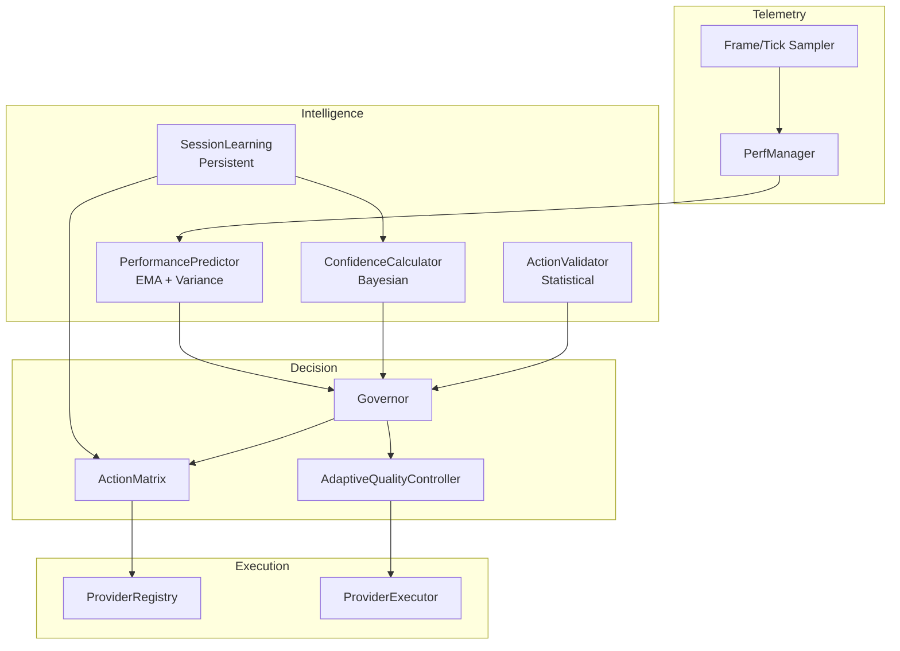

<div align="center">
  <h1>⚡ NOZH ⚡</h1>
  <p>
    <b>Intelligent Performance Orchestrator for Minecraft (Fabric)</b><br>
    <i>Orquestador Inteligente de Rendimiento para Minecraft (Fabric)</i>
  </p>

  <p>
    <a href="https://github.com/NozhMod/Nozh/actions"></a>
    <a href="https://fabricmc.net/"></a>
    <a href="#"></a>
    <a href="ROADMAP.md"></a>
  </p>
</div>

---

# 🇬🇧 English | 🇪🇸 Español

> **Quick Jump:** [English](#english) | [Español](#español)

---

<a name="english"></a>

# 🇬🇧 English

## What is NOZH?

**NOZH** is an **intelligent, AI-powered performance orchestrator** for Minecraft that automatically optimizes your game settings in real-time. Unlike traditional optimization mods that use static configurations, NOZH implements a sophisticated **Machine Learning Core** with:

- **Bayesian Confidence Scoring** - Learns what works on YOUR hardware
- **EMA Trend Detection** - Predicts performance drops before they happen
- **Scenario Recognition** - Adapts to Combat, Building, Exploration, AFK
- **Anti-False-Positive System** - Only acts when statistically confident

Whether you have a $300 potato laptop or a $5000 4090 beast, NOZH extracts every drop of performance.

### 🎯 Core Philosophy

- **Adaptive**: Creates a unique profile for your hardware that improves over time
- **Intelligent**: Detects what you're doing and adjusts settings instantly
- **Compatible**: Built-in knowledge base of 50+ mods to prevent conflicts
- **Transparent**: Professional HUD shows exactly what's happening
- **Safe**: Automatic rollback if any change doesn't help

---

## ✨ What's New in v0.3.1 "Intelligence"

### 🧠 AI-Powered Decision Making

| Feature | Description |
|---------|-------------|
| **Bayesian Confidence** | Updates beliefs based on prediction accuracy |
| **Scenario Modifiers** | Conservative in combat (0.85x), aggressive when idle (1.1x) |
| **Success Streaks** | Rewards consistent improvements (+15% confidence boost) |
| **Dual EMA Trends** | Fast (α=0.4) and slow (α=0.1) for crossover detection |
| **Micro-Stutter Detection** | Catches jank that P95 misses |

### 📊 Expected Performance Gains

| Scenario | FPS Improvement | Notes |
|----------|-----------------|-------|
| **Lobby/Hub** | +30-50% | Many players, high entity count |
| **Mob Farms** | +40-60% | Entity-heavy, predictable |
| **Combat (PvP/PvE)** | +20-35% | Conservative mode, prioritizes stability |
| **Exploration** | +15-25% | Chunk loading aware |
| **AFK Mode** | +100% | Caps to 30 FPS, maximum savings |

> **Disclaimer**: Real gains depend on your hardware, modpack, and starting FPS.
> Low-end systems typically see larger percentage improvements.

---

## 🔬 Current Capabilities

### ✅ What NOZH Can Do Now

1. **Real-Time Optimization**
   - Adjusts particles, clouds, entity shadows, render distance
   - Responds to performance changes within 10-30 seconds
   - Gradual quality recovery when performance stabilizes

2. **Smart Learning**
   - Remembers which actions work on YOUR PC
   - Avoids repeating ineffective optimizations
   - Persists knowledge across sessions

3. **Scenario-Aware**
   - Detects: Combat, Building, Exploration, AFK, Loading
   - Applies different strategies per scenario
   - Never reduces render distance during combat

4. **Safety Guaranteed**
   - Automatic rollback within 45 seconds
   - Safe Mode after 3 crashes in 5 minutes
   - Never touches settings you've locked

### ⏳ What's Coming Next (v0.4+)

1. **Neural Network Predictor** - True ML-based spike prediction
2. **Server-Side Optimizer** - TPS monitoring, network optimization
3. **Cloud Hardware Database** - Community-sourced optimal settings
4. **Extreme Potato Mode** - Support for 2GB RAM / Intel HD 4000

---

## 🎮 Commands

```
/nozh status          - System overview & current state
/nozh selfcheck       - Run diagnostic health check
/nozh hud             - Configure the HUD (presets/widgets)
/nozh potato          - Enable/Disable Potato Mode
/nozh profile         - View active optimization profile
/nozh history         - View recent optimization actions
/nozh export          - Export diagnostic data
```

---

## 🛠️ Installation

1. Install [Fabric Loader](https://fabricmc.net/use/) for Minecraft 1.20.1
2. Install [Fabric API](https://modrinth.com/mod/fabric-api)
3. Download NOZH from releases
4. Place in your `mods` folder
5. Launch and enjoy automatic optimization!

**Recommended Companion Mods:**

- Sodium (graphics)
- Lithium (server)
- FerriteCore (memory)

NOZH automatically detects and coordinates with these mods.

---

<a name="español"></a>

# 🇪🇸 Español

## ¿Qué es NOZH?

**NOZH** es un **orquestador de rendimiento inteligente con IA** para Minecraft que optimiza automáticamente tu configuración en tiempo real. A diferencia de los mods tradicionales que usan configuraciones estáticas, NOZH implementa un **Núcleo de Aprendizaje Automático** con:

- **Puntuación de Confianza Bayesiana** - Aprende qué funciona en TU hardware
- **Detección de Tendencias EMA** - Predice caídas de rendimiento antes de que ocurran
- **Reconocimiento de Escenarios** - Se adapta a Combate, Construcción, Exploración, AFK
- **Sistema Anti-Falsos-Positivos** - Solo actúa cuando está estadísticamente seguro

Ya tengas una laptop "patata" de $300 o una bestia con 4090 de $5000, NOZH extrae cada gota de rendimiento.

### 🎯 Filosofía Central

- **Adaptativo**: Crea un perfil único para tu hardware que mejora con el tiempo
- **Inteligente**: Detecta qué estás haciendo y ajusta configuraciones instantáneamente
- **Compatible**: Base de conocimiento de 50+ mods para prevenir conflictos
- **Transparente**: HUD profesional muestra exactamente qué está pasando
- **Seguro**: Rollback automático si algún cambio no ayuda

---

## ✨ Novedades en v0.3.1 "Inteligencia"

### 🧠 Toma de Decisiones con IA

| Característica | Descripción |
|----------------|-------------|
| **Confianza Bayesiana** | Actualiza creencias basado en precisión de predicciones |
| **Modificadores por Escenario** | Conservador en combate (0.85x), agresivo en AFK (1.1x) |
| **Rachas de Éxito** | Recompensa mejoras consistentes (+15% de confianza) |
| **Tendencias EMA Dual** | Rápido (α=0.4) y lento (α=0.1) para detección de cruce |
| **Detección de Micro-Stutters** | Captura jank que P95 no detecta |

### 📊 Ganancias de Rendimiento Esperadas

| Escenario | Mejora de FPS | Notas |
|-----------|---------------|-------|
| **Lobby/Hub** | +30-50% | Muchos jugadores, alto conteo de entidades |
| **Granjas de Mobs** | +40-60% | Muchas entidades, predecible |
| **Combate (PvP/PvE)** | +20-35% | Modo conservador, prioriza estabilidad |
| **Exploración** | +15-25% | Consciente de carga de chunks |
| **Modo AFK** | +100% | Limita a 30 FPS, máximo ahorro |

> **Nota**: Las ganancias reales dependen de tu hardware, modpack y FPS inicial.
> Sistemas de gama baja típicamente ven mejoras porcentuales mayores.

---

## 🔬 Capacidades Actuales

### ✅ Lo Que NOZH Puede Hacer Ahora

1. **Optimización en Tiempo Real**
   - Ajusta partículas, nubes, sombras de entidades, distancia de render
   - Responde a cambios de rendimiento en 10-30 segundos
   - Recuperación gradual de calidad cuando el rendimiento se estabiliza

2. **Aprendizaje Inteligente**
   - Recuerda qué acciones funcionan en TU PC
   - Evita repetir optimizaciones ineficaces
   - Persiste conocimiento entre sesiones

3. **Consciente del Escenario**
   - Detecta: Combate, Construcción, Exploración, AFK, Cargando
   - Aplica diferentes estrategias por escenario
   - Nunca reduce distancia de render durante combate

4. **Seguridad Garantizada**
   - Rollback automático en 45 segundos
   - Modo Seguro después de 3 crashes en 5 minutos
   - Nunca toca configuraciones que hayas bloqueado

### ⏳ Lo Que Viene Después (v0.4+)

1. **Predictor de Red Neuronal** - Predicción de spikes con ML verdadero
2. **Optimizador del Servidor** - Monitoreo de TPS, optimización de red
3. **Base de Datos Cloud** - Configuraciones óptimas de la comunidad
4. **Modo Patata Extremo** - Soporte para 2GB RAM / Intel HD 4000

---

## 🎮 Comandos

```
/nozh status          - Vista general del sistema y estado actual
/nozh selfcheck       - Ejecutar chequeo de salud
/nozh hud             - Configurar el HUD (presets/widgets)
/nozh potato          - Activar/Desactivar Modo Patata
/nozh profile         - Ver perfil de optimización activo
/nozh history         - Ver acciones de optimización recientes
/nozh export          - Exportar datos de diagnóstico
```

---

## 🛠️ Instalación

1. Instala [Fabric Loader](https://fabricmc.net/use/) para Minecraft 1.20.1
2. Instala [Fabric API](https://modrinth.com/mod/fabric-api)
3. Descarga NOZH de releases
4. Colócalo en tu carpeta `mods`
5. ¡Lanza el juego y disfruta de la optimización automática!

**Mods Compañeros Recomendados:**

- Sodium (gráficos)
- Lithium (servidor)
- FerriteCore (memoria)

NOZH detecta y coordina automáticamente con estos mods.

---

## 📊 Technical Architecture



---

## 🔮 Roadmap

See [ROADMAP.md](ROADMAP.md) for the full vision to NOZH 2.0:

- **Phase 7**: AI-Powered Optimization *(in progress)*
- **Phase 8**: Server Optimization
- **Phase 9**: Cloud & Community
- **Phase 10**: Modpack Integration

---

<div align="center">
  <p><i>Made with ❤️ by Nozhtrash</i></p>
  <p><b>NOZH: The First Intelligent Optimization Orchestrator</b></p>
  <p><i>"Optimization Solved."</i></p>
</div>
