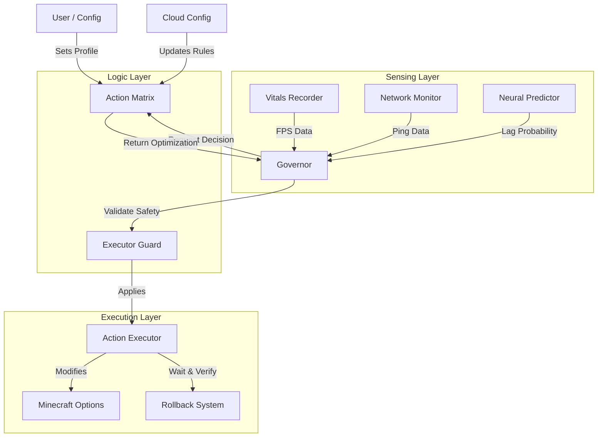

# 🏗️ Technical Deep Dive (Architecture)

**Role**: System Architecture Documentation
**Target Audience**: Developers, Modders, Expert Users.

NOZH is architected as a **Control Loop System** (Monitor -> Decide -> Act). It follows a strict "Governor" pattern to ensure safety and stability.

---

## 1. System Topology

---

## 2. Core Components

### A. The Governor (`IntegratedGovernor`)
The central brain. It runs every **Game Tick (20Hz)** but makes decisions on a **Budget (default 8ms)**.
- **Responsibility**: Aggregates data from all sensors.
- **Safety**: If the Governor crashes, it auto-disables to prevent bringing down the whole game.

### B. The Matrix (`ActionMatrixRules`)
A hardcoded (but hot-patchable) lookup table determining *what* to do.
- **Structure**: `Map<Scenario, Map<OptimizationProfile, RuleSet>>`.
- **Query**: `getRule(Scenario.COMBAT, Profile.POTATO)`.
- **Result**: Returns strict values (e.g., `RENDER_DISTANCE = 6`).

### C. The Executor (`StandardActionExecutor`)
The only component allowed to touch Minecraft code.
- **Atomic Actions**: Changes are atomic.
- **Thread Safety**: All changes are scheduled for the Main Render Thread.

---

## 3. The Optimization Loop

1.  **Telemetry Tick**: `VitalsRecorder` records the frame time of the last frame.
2.  **Analysis Tick**: Every 100 ticks (5s), `AnomalyDetector` analyzes the history.
    - Calculates `P95` (95th percentile frametime).
    - Checks for `Spikes` (Variance > Threshold).
3.  **Decision**:
    - If `P95 > TargetFPS_Time` (e.g., >16ms): **Optimizing Required**.
    - Governor queries AI: "Are we CPU bound or GPU bound?"
    - Governor queries Matrix: "What is the next available optimization for this Scenario?"
4.  **Action**:
    - Executor applies `LOWER_CLOUDS`.
5.  **Verification**:
    - Rollback system marks timestamp.
    - Waits 45s.
    - If `NewP95 > OldP95`, action is reverted.

---

## 4. Storage & Persistence

NOZH avoids polluting the main Minecraft config folder.
- **Config**: `config/nozh/nozh.json` (User preferences).
- **State**: `config/nozh/state.json` (Persistent AI learning data).
- **Cache**: `config/nozh/compatibility_cache.json` (Cloud rules).

---

## 5. Security & Isolation

NOZH runs in **Isolation**.
- It does **not** rely on Mixin for core logic (only for hooks).
- It does **not** access private fields via Reflection (uses Accessors).
- It catches `Throwable` at the top level of every tick.

This ensures that even if NOZH has a catastrophic logic bug, it will simply "stop optimizing" rather than "crash the game".
