# Benchmarking Methodology (Frametime)

This document defines **how to measure frametime stability** for NOZH, the **reproducible scenarios** to run, and the **reporting format** (tables + graphs) for P95/P99 results.

## 1) Measurement Methodology

### Tools (choose one primary + one secondary verifier)
- **Spark** (recommended):
  - Use the `frametime` / `fps` graph view and export if available.
  - Capture raw frametime samples or summary percentiles.
- **VisualVM** (secondary verifier):
  - Attach to the JVM and ensure frame pacing issues correlate with CPU/GPU load.
  - Use sampling to correlate frametime spikes with thread activity.
- **Frametime overlay tools** (e.g., built-in frametime graphs or external overlays):
  - Record per-frame data if possible; otherwise capture P95/P99 from overlay.

### Measurement Duration
- **Warm-up:** 60s (discard from results).
- **Measurement window:** 180s minimum (longer for unstable scenarios).
- **Cooldown:** 30s (optional, not counted).

### Hardware + Environment Requirements (must be documented)
- **CPU / GPU / RAM** (exact model + clock if relevant).
- **OS + JVM + MC version**.
- **Display / resolution** (e.g., 2560×1440 @ 144Hz).
- **Renderer / shaders** (and version).
- **Power mode** (e.g., High Performance, laptop plugged in).
- **Background load** (close heavy apps; record unavoidable daemons).

> **Note:** This matrix defines the supported runtime combinations. See **Compatibility Matrix (Runtime)** in `docs/ARCHITECTURE.md`.

### Graphics + Game Config (must be fixed)
- **Render distance** (e.g., 12–16).
- **Simulation distance** (e.g., 8–12).
- **Shadow / shader settings**.
- **Mipmaps / biome blend**.
- **Entity distance** and **particles**.

### Data Collected
- **Average frametime (ms)**
- **P95 frametime (ms)**
- **P99 frametime (ms)** (if sample count ≥ 2,000)
- **Spike count** (>500ms, if available)
- **Sample count**

## 2) Reproducible Scenarios

Run **all three** scenarios if possible. Each scenario must be a **saved world** with coordinates and a short reproduction script.

### Scenario A — Combat with Mobs
- **World:** Flat + test arena; fixed time of day.
- **Setup:** 50–100 mobs in a bounded area.
- **Repro steps:**
  1. Teleport to arena (`/tp <coords>`).
  2. Start combat with a consistent pattern (same weapon, same pathing).
  3. Measure for 180s.

### Scenario B — Redstone Tick-Heavy
- **World:** Redstone stress test (clock circuits, observers, pistons).
- **Setup:** 5–10 large contraptions running simultaneously.
- **Repro steps:**
  1. Teleport to control room.
  2. Enable all clocks with a single lever.
  3. Measure for 180s while idling at the same location.

### Scenario C — Megabase with Entities
- **World:** Large base with dense entities (villagers, item frames, hoppers).
- **Setup:** Minimum 300 active entities within render range.
- **Repro steps:**
  1. Teleport to base center.
  2. Walk a fixed 30s path loop, repeat 6 times.
  3. Measure for 180s.

### Critical Scenarios (must-run)

These scenarios are **critical** and required for any benchmark run:

- **Critical A — Combat with Mobs:** Scenario A above.
- **Critical B — Redstone Tick-Heavy:** Scenario B above.
- **Critical C — Megabase with Entities:** Scenario C above.

## 3) Recording Configuration

For each run, capture:
- **Mods list** (exact versions)
- **Shader pack** (and version)
- **Render distance / simulation distance**
- **NOZH config** (notably thresholds + target FPS)
- **Any deviations** from the methodology

## 4) Scenario Coverage Metrics

Use these metrics to summarize how much of the critical scenario set was executed and how many runs met the success threshold.

**Definitions**
- **Coverage %** = (critical scenarios executed / total critical scenarios) * 100.
- **Pass %** = (critical scenarios with P95/P99 within threshold / critical scenarios executed) * 100.

**Success threshold**
- Use the **target FPS** and **frametime thresholds** defined in the NOZH config/policy when available.
- If no explicit threshold is defined, treat a scenario as **pass** when **both P95 and P99 are <= 1.5x target frametime** (ms).

**Example table**

| scenario | executed (Y/N) | pass/fail | p95 | p99 | notes |
| --- | --- | --- | --- | --- | --- |
| Combat (mobs) | Y | pass | 14.2 | 17.8 | Within 1.5x target frametime |
| Redstone | Y | fail | 18.5 | 26.1 | P99 exceeded threshold |
| Megabase | N | n/a | -- | -- | Not run in this cycle |

## 5) Results Template (Table + Graphs)

> Replace placeholders with actual measurements. If multiple runs are performed, report **mean** and **std dev** per scenario.

### Table (per scenario)

| Scenario | Avg Frametime (ms) | P95 (ms) | P99 (ms) | Spike Count | Samples | Notes |
| --- | --- | --- | --- | --- | --- | --- |
| Combat (mobs) | `--` | `--` | `--` | `--` | `--` | `--` |
| Redstone | `--` | `--` | `--` | `--` | `--` | `--` |
| Megabase | `--` | `--` | `--` | `--` | `--` | `--` |

### Graphs

**Option A — Mermaid (if supported):**

```mermaid
xychart-beta
  title "Frametime P95/P99 by Scenario"
  x-axis [Combat, Redstone, Megabase]
  y-axis "Frametime (ms)" 0 --> 80
  bar "P95" [0, 0, 0]
  bar "P99" [0, 0, 0]
```

**Option B — External chart (CSV export):**

1. Export CSV with columns: `scenario, avg_ms, p95_ms, p99_ms`.
2. Generate chart using spreadsheet or plotting tool.

## 6) Variability + Limits

Include a short note that captures:
- **Run-to-run variance** (std dev or range) and potential causes (GC, background load).
- **Measurement limits** (sample count too low for P99, thermal throttling, shader differences).
- **Any anomalies** (spike bursts, outlier runs, unexpected CPU/GPU saturation).
